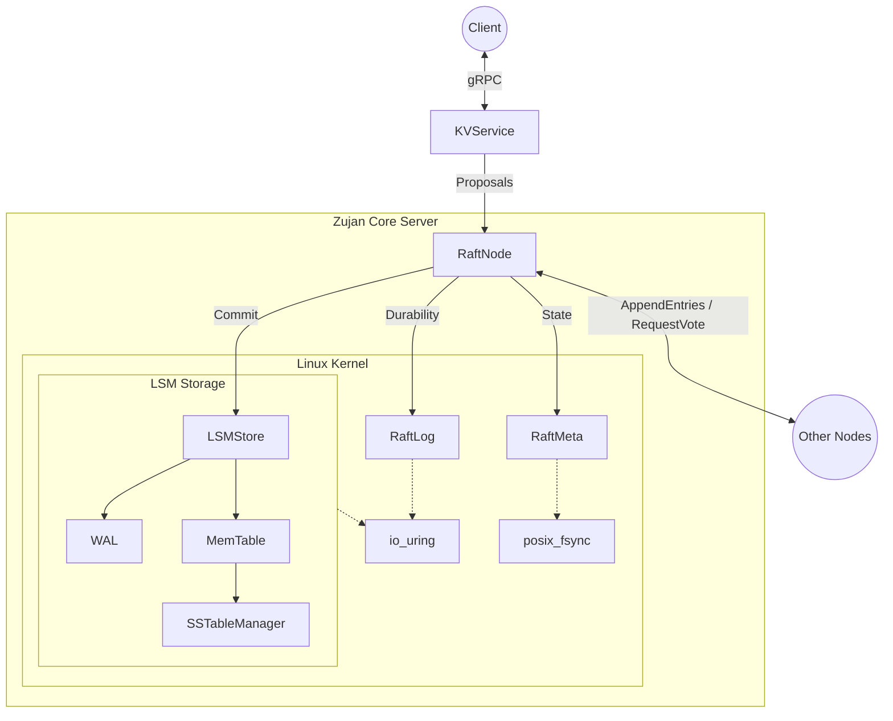

<div align="center">

# Zujan (竹简)

**A High-Performance, Distributed LSM-Tree Storage Engine built with Modern C++ and Raft Consensus.**

[](https://en.cppreference.com/w/cpp/compiler_support)
[](https://cmake.org)
[](https://grpc.io/)
[](https://kernel.dk/io_uring.pdf)
[](LICENSE)

</div>

---

## 📖 Overview

**Zujan** is an advanced, distributed Key-Value storage engine built from scratch. It marries the high-write-throughput capabilities of a Log-Structured Merge-Tree (LSM-Tree) with the rigorous fault-tolerance of the Raft consensus algorithm. Designed for modern hardware, Zujan heavily utilizes `io_uring` for asynchronous disk I/O, lock-free data structures for concurrency, and C++23 features for maximizing runtime performance.

Whether you are looking to understand the core mechanics of distributed systems or need a high-performance foundation for a clustered database, Zujan provides a clean, zero-overhead, and rigorously documented architecture.

---

## ✨ Core Features

### 📦 LSM-Tree Storage Engine
- **Lock-Free MemTable**: Utilizes a highly optimized concurrent `SkipList` powered by an internal `Arena` allocator, eliminating `malloc` latency and lock-contention.
- **Advanced SSTables**: Implements block-based persistence featuring MurmurHash3 Bloom Filters, prefix compression, and a sharded LRU Block Cache for blazing-fast point lookups.
- **Asynchronous Disk I/O**: Fully integrates `io_uring` via a dedicated event polling loop to decouple CPU work from disk latency, achieving incredible IOPS.
- **Zero-Cost Abstractions**: Relies purely on `std::expected` and `noexcept` mechanics; absolutely zero C++ exception overhead in the data path.

### 🌐 Distributed Consensus (Raft)
- **Strong Consistency**: Complete integration of the Raft consensus protocol, managing distributed state replication, leader election, and log matching.
- **Event-Driven Architecture**: The `RaftNode` eliminates global mutex bottlenecks by adopting a strict MPSC (Multi-Producer Single-Consumer) lock-free EventLoop.
- **High-Performance RPC**: Powered by bidirectional `gRPC` streams. RPC handlers decouple from the state machine via `std::promise` and `std::future`, preventing network jitter from stalling cluster consensus.
- **Durable Raft Log**: Uses a highly optimized, independently isolated Persistent Log (`RaftLog`) utilizing memory-mapped index caches and kernel-level `WriteAligned` Group Commits.

### 🛠️ Microsecond Logging
- **Async Logger**: A bespoke, double-buffered asynchronous logging framework leveraging C++23 `std::println`, running completely off the critical path.

---

## 🏗️ Architecture Stack



---

## 🚀 Getting Started

### Prerequisites

- **OS**: Linux (kernel 5.1+ recommended for `liburing` support)
- **Compiler**: GCC 13+ or Clang 16+ (Must support C++23 and `std::println`)
- **Build System**: CMake (>= 3.14)
- **Dependencies**: 
  - `gRPC` & `Protobuf`
  - `liburing`
  - `gtest` & `google-benchmark` (fetched automatically)

### Building the Project

1. **Clone the repository:**
   ```bash
   git clone https://github.com/yourusername/zujan.git
   cd zujan
   ```

2. **Configure and Build:**
   ```bash
   mkdir build && cd build
   cmake -DCMAKE_BUILD_TYPE=Release ..
   cmake --build . -j$(nproc)
   ```

3. **Run Unit Tests:**
   ```bash
   ./bin/main_test
   ```

---

## 💻 Usage

### Starting a Local Cluster
You can simulate a 3-node local cluster using the generated binaries and environment variables.

**Terminal 1 (Node 1 - Port 50051):**
```bash
RAFT_NODE_ID=1 RAFT_PEERS="localhost:50052,localhost:50053" SERVER_PORT=50051 ./bin/zujan
```

**Terminal 2 (Node 2 - Port 50052):**
```bash
RAFT_NODE_ID=2 RAFT_PEERS="localhost:50051,localhost:50053" SERVER_PORT=50052 ./bin/zujan
```

**Terminal 3 (Node 3 - Port 50053):**
```bash
RAFT_NODE_ID=3 RAFT_PEERS="localhost:50051,localhost:50052" SERVER_PORT=50053 ./bin/zujan
```

Watch as the nodes instantly communicate via gRPC, drop into the Election loop, elect a Leader, and begin synchronizing heartbeat pulses natively utilizing the async logging pipeline.

---

## 📂 Project Structure

```text
zujan/
├── src/
│   ├── storage/          # LSM-Tree Engine (MemTable, SSTable, Block, Arena)
│   ├── consensus/        # Raft Protocol (Node, Log, Meta, gRPC Services)
│   ├── utils/            # Async Logging, utilities
│   ├── main.cc           # Application Entry Point
│   └── zujan.proto       # Protobuf Definitions for Raft & KV
├── test/                 # GTest Suites and Google Benchmark
├── build/                # Compilation output (Binaries and Libs)
└── CMakeLists.txt        # Build configurations
```

---

## 📜 License

Zujan is open-sourced software licensed under the **MIT License**.

---
<div align="center">
<i>"Built with 🫀 for Distributed Systems enthusiasts."</i>
</div>
